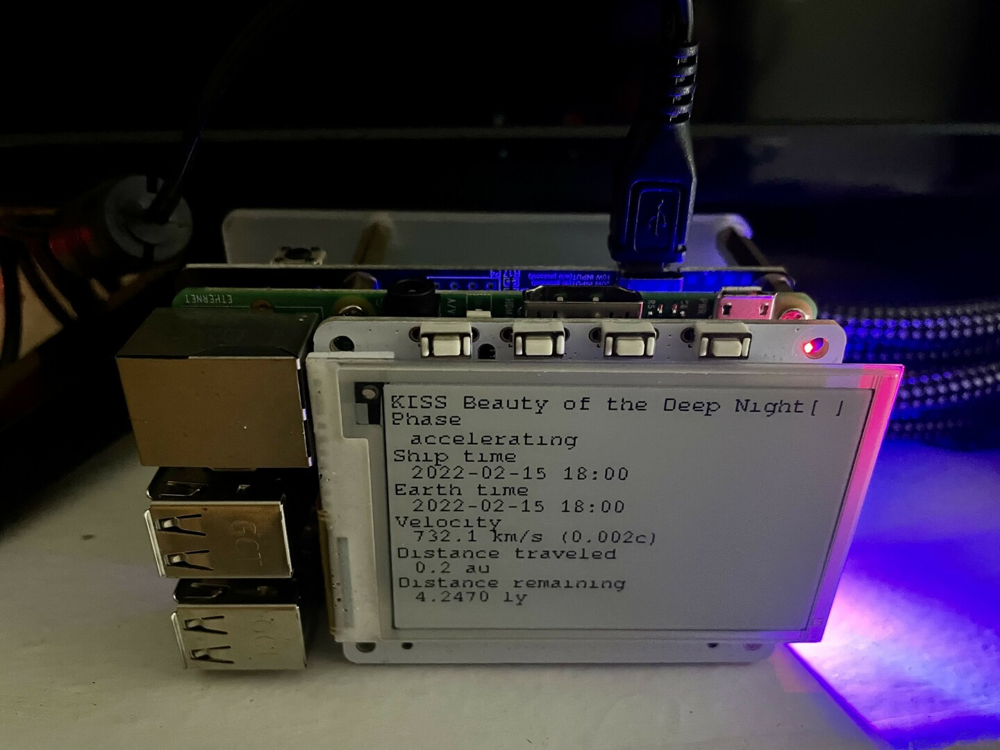

# PROXIMA MISSION

## Quick links

* [Mathematica notebook](https://www.wolframcloud.com/env/kyle/Published/proxima.nb)
* [Source repository](https://github.com/kisom/proxima)
* [Mission control](https://sheltered-meadow-82131.herokuapp.com/)
* [Gemini homepage](gemini://freeside.wntrmute.net/projects/proxima/)

## Background

For a long time, I've had an idea for a project: to simulate a mission to
Proxima Centauri on a computer in real time. There's a couple reasons I want to
do this: I think it's an interesting exercise in keeping a computer running for
a long time (just over 1900 days, if my math is right), and because I'm a space
nerd. It just seems like a cool idea. I sketched out the idea 
[in Mathematica](https://www.wolframcloud.com/env/kyle/Published/proxima.nb),
then wrote some Go code.

What exactly is this? I wrote some code that is a *very* *basic* simulation of
a flight to the star Proxima Centauri. In the real world, I plan to run a
single process for nearly five and a quarter years. If it fails or stops, the
mission is lost, simulating the requirement for a stable control system for the
ship. This means that if I move, I can't just turn the system off. I've set a
"launch" date for my 35th birthday, which is when the system is finalized and
the simulation can't be touched. That means I'll be just over 40 years old when
it finishes, which is a little sobering.

## Components

* cmd/flightconn: the flight control software
* cmd/flightconnui: Python code that drives the eInk display
* cmd/flightsim: speedrun the flight to verify the calculations
* cmd/flightsim_test: the flight simulator as a Go test
* cmd/missionctl: the web frontend
* cmd/relay: fetch updates from the flight control software and post to mission control
* comms/: ZeroMQ connectivity; the UI receives updates from the flight control software over ZeroMQ.
* database/: database configuration to talk to mission control
* handler/: HTTP handlers
* milestones/: calculate the various milestones as described in the notebook
* mission/: the flight simulator core software
* ops/: various operations bits, such as the SQL schema and systemd service files
* physics/: the physics calculations behind the software
* rat/: convenience functions for dealing with math/big.Rat

## System overview

### Raspberry Pi / flight hardware



The flight control software runs on a Raspberry Pi 3B.

* `flightconn` runs the flight. `flightconn` sets up an HTTP endpoint
  that dumps the current flight information as JSON, and a ZeroMQ publisher
  that broadcasts updates regularly.
* `flightconnui` receives updates from `flightconn` over a ZeroMQ subscriber
  socket.
* `relay` runs as a cronjob to regularly sync flight updates to mission
  control. It posts updates to `missionctl` as HTTP push requests.

### Mission control

`missionctl` currently runs in a Heroku instance. It receives updates via an
HTTP post.


## Setup

### Install the eInk drivers for the 2.7" PaPiRus hat

```
sudo apt install python3 python3-pip
curl -sSL https://pisupp.ly/papiruscode | sudo bash
sudo papirus-setup
```

NB: this also installs git.

Add `i2c-rtc,mcp7940x=1` to the dtcoverlay to enable the RTC. 

### Install the zeroMQ drivers.

```
sudo apt install libczmq-dev python3-zmq
```

### Install Go and build tools

I install Go using [this method](https://www.e-tinkers.com/2019/06/better-way-to-install-golang-go-on-raspberry-pi/).
